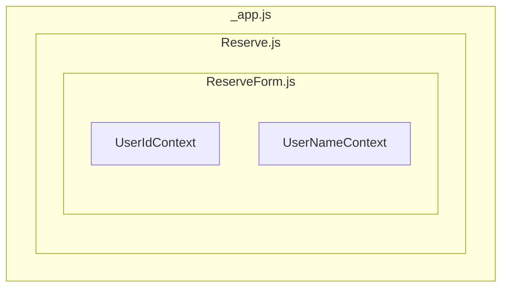

# - 프로젝트 개요
예전 PHP 프레임워크인 Laravel을 통해 개발한 회의실 예약 프로젝트의 일부 기능을 프로트 영역은 react와 react 프레임워크인 Next.js, 백엔드 영역은 Spring Boot, Spring Data JPA, Spring Security 등을 통해 구현해 보았으며 해당 문서에서는 프론트 부분에 대해 중점적으로 다루었다.
<br /><br />
# - 개발기간
- 25.04 ~ 25.05(약 1.5개월)\
<br /><br />
# - 개발환경
- node.js v18.20.5
- react v19.0.0
- Next.js v15.2.4
- Semantic UI React, Axios, FullCalendar 등 라이브러리
<br /><br />
# - 주요기능
- 사용자인증
기본 사용자 인증, JWT 토큰 발급, 재발급, localStorage와 sessionStorage를 통한 사용자 접근 제어, react Context를 통한 값 전달 처리
- 게시판 :\
기본 게시판 CRUD 기능 및 검색, Semantic UI를통한 페이징 처리, react reducer를 통한 검색 기능, react useRef를 이용한 렌더링 제어 및 DOM 엘리먼트 처리 등
- 코멘트 :\
코멘트 CRUD 기능, 코멘트 트리 UI 표현
- 예약 :\
특정일자 시간대 예약 및 수정, 사용자 권한에 따른 예약 제한,
FullCalendar 라이브러리를 통한 달력 UI 표현, react createRef를 이용한 클래스 컴포넌트 DOM 오브젝트 처리 등
<br /><br />
# - 특이사항
- Next.js의 Pages Router를 통해 구현 하였으며 공식 문서의 경우 App Router 사용을 권장 하나 Next.js를 처음 접할 경우 Pages Router부터 사용하는 것이 추천되어 Pages Router를 통해 구현 하였으며 향후 App Router 구조로 마이그레이션 진행 예정
참고 -\
<https://dev.to/dcs-ink/nextjs-app-router-vs-pages-router-3p57>\ <https://stackoverflow.com/questions/76570208/what-is-different-between-app-router-and-pages-router-in-next-js>\
<https://www.reddit.com/r/nextjs/comments/1gdxcg5/why_do_you_still_prefer_page_router_over_app/>

- 기본 App 재정의 하여 _app.js를 통한 커스텀 앱 형태로 구현\
참고 -\
<https://www.dhiwise.com/post/the-power-of-nextjs-custom-routes-in-modern-web-development>\
<https://medium.com/@farihatulmaria/what-is-the-purpose-of-the-app-js-and-document-js-files-in-a-next-js-application-397f22fed69e>

- UI는 Semantic UI React 라이브러리를 사용하여 구현
- 백엔드 부분과 데이터 요청, 응답을 위해 Axios 라이브러리를 사용 

<!-- <details>
<summary>제목</summary> -->
<!-- </details> -->
## 1. 사용자인증
### 1.1 인증처리
사용자 인증 및 접근 제어는 Spring Security와 JWT 라이브러리를 통해서 구현 하였으며 로그인 성공시 localStorage, sessionStorage에 인증과 권한 확인에 필요한 값을 저장한다.


login.js
```js
await Axios.post(`${process.env.NEXT_PUBLIC_API_URL}/api/v1/user/login`, 
          {
            loginId: loginId,
            userPassword: userPassword
          },
          {
            withCredentials: true
          }
        )
        .then(function (response) {
          //인증 성공 시 localStorage, sessionStorage에 인증 정보를 저장한다.
          if (response.headers.access) {
            localStorage.setItem("access", response.headers.access);
            window.sessionStorage.setItem("loginId", loginId);
            window.sessionStorage.setItem("userName", response.headers["username"]); 
            setAccessToken(localStorage.getItem("access"));
            setLoginUserId(loginId);
            setLoginUserName(response.headers["username"]);
          }
          alert("Login Success");
          router.push(`/`);
        })
```

### 1.2 사용자 정보 처리
로컬과 세션 스토리지에 인증 정보와 사용자 정보를 저장 후 로그인 컴포넌트에서 _app.js로 부터 전달 받은 state setter를 통해 액세스 토큰과 사용자 아이디 값을 state에 저장하고 _app.js는 useEffect를 통해 state의 변경을 감지하여 컴포넌트를 리렌더링 한다

- _app.js
```js
export default function MyApp({ Component, pageProps }) {
  const [accessToken, setAccessToken] = useState();
  const [loginUserId, setLoginUserId] = useState();
  const [loginUserName, setLoginUserName] = useState("");
  const [reissueResult, setReissueResult] = useState(false);
...중략
// _app.js의 useEffect를 통해 렌더링 시 state setter로 state에 값을 할당한다.
  useEffect(() => {
    setAccessToken(localStorage.getItem("access"));
    setLoginUserId(window.sessionStorage.getItem("loginId"));
    setLoginUserName(window.sessionStorage.getItem("userName"));
  }, [accessToken, loginUserId, loginUserName, reissueResult]);
```

### 1.3 react Context를 통한 자식 컴포넌트로 값 전달
useEffect를 통한 state 변경 감지 부분 추가는 공유 레이아웃 컴포넌트에서 변경된 state를 값을 사용하기 위함과 이후 react Context를 통한 값 전달을 구현해 보기 위해서이다.  
(<span style="color:red">**Next.js 13 이후 App Router의 Server Component는 Context Provider를 미지원 하므로 향후 마이그레이션 시에는 Client Component를 이용해 구성해 볼 예정**.</span> )  
참고 -\
<https://nextjs.org/docs/app/getting-started/server-and-client-components#context-providers>  
<https://nextjs-ko.org/docs/app/building-your-application/rendering/server-components>


- UserContext.js
```js
// createContext로 Context를 상속받는 페이지에서 받을 컨텍스트들을 선언
import { createContext } from 'react';
export const UserIdContext = createContext("userIdContext");
export const UserNameContext = createContext("userNameContext");
```

- _app.js
```js
  return (
    <div style={{ width: 800, margin: "0 auto" }}>
      <UserIdContext value={loginUserId}>
        <UserNameContext value={loginUserName}>
          <Top setAccessToken={setAccessToken}
          setLoginUserId={setLoginUserId} 
          setLoginUserName={setLoginUserName} 
          accessToken={accessToken}/>
          <Component {...pageProps} 
          setAccessToken={setAccessToken} 
          setLoginUserId={setLoginUserId} 
          setLoginUserName={setLoginUserName} 
          reissueAccessToken={reissueAccessToken}/>
          <Footer />
        </UserNameContext>
      </UserIdContext>
    </div>
  );
```
Context를 선언하고 _app.js에서 Context를 provider로 하위 컴포넌트로 전달하여 다수 컴포넌트나 여러 단계를 거치는 하위 컴포넌트에서 사용자 정보를 사용할 수 있도록 하였다.

- Context 사용 예시)

```js
import { UserIdContext } from './UserContext.js';
import { UserNameContext } from './UserContext.js';
... 생략
const userId = useContext(UserIdContext);
const userName = useContext(UserNameContext);
```
_app.js에서 Context를 제공하여 하위 ReserveForm 컴포넌트에서 로그인된 사용자의 아이디와 이름 정보를 제공된 Context에서 가져와 사용 할 수 있다.


### 1.4 인증토큰 재발급
로그인이 필요한 페이지에서는 사용의 인증토큰을 헤더값으로 서버에 전달하여 인증, 만료 여부를 확인 후 페이지를 보여주도록 하였다.

- 화면 페이지
```js
async function getData() {
  await Axios.get(`${process.env.NEXT_PUBLIC_API_URL}/api/v1/reserve/reserveList`, {
      headers: {
        "Content-Type": "application/json", 
        access: localStorage.getItem("access") 
        // 인증토큰 값 헤더 데이터로 전달
      },

```

- 서버의 인증 상태 확인 부분
```java
    try {
      jwtUtil.isExpired(accessToken);
    } catch (ExpiredJwtException e) {
      PrintWriter writer = response.getWriter();
      writer.print("accessToken expired");
      response.setStatus(HttpServletResponse.SC_UNAUTHORIZED);
      return;
    }catch (JwtException e) {
      PrintWriter writer = response.getWriter();
      writer.print("accessToken not valid");
      response.setStatus(HttpServletResponse.SC_BAD_REQUEST);
      return;
    }
```
- 인증토큰 만료 시 토큰 재발급 여부 확인


사용자 인증 성공 시 인증 jwt 토큰과 토큰 만료 시 재발급을 위한 refresh 토큰이 발급되며 사용자 화면에서 유효한 토큰이 요구되는 페이지를 만료된 토큰을 가지고 접근 시 서버를 통해서  401에러가 리턴되며 해당 코드 리턴 시 토큰 재발급 여부를 확인 후 재발급 되도록 구현 하였다.

- 사용자 페이지의 인증 만료 여부 및 재발급 여부 확인 부분
```js
async function getData() {
  await Axios.get(`${process.env.NEXT_PUBLIC_API_URL}/api/v1/reserve/reserveList`, {
      headers: {
        "Content-Type": "application/json", 
        access: localStorage.getItem("access")
        // 인증토큰 값 헤더 데이터로 전달
      },
      params: {
        reserveDate: toolBarState,
        reserveUserId: userId
      },
    }
  ).then((response) => {
    
... 중략

.catch(async function (error) {
      console.log("error : " + error);
      // 토큰을 통한 인증 실패 시 리턴 코드 확인
      if(error.response.status === 401){
        // 토큰 만료 시 서버에서 401에러를 리턴하여 재발급 여부 확인
        if(confirm("Session is expired. Do you want Reissue?"))
          {
            setTimeout(() => console.log("after"), 3000);
            const reissueResult = await reissueAccessToken();
            if(reissueResult){
              alert("Reissue success")
            }else{
              alert("Reissue false");
              router.push(`/`);
            }
          }
          else
          {
            console.log("Reissue false")
            router.push(`/`);
          }
      }
    });
```


- _app.js의 토큰 재발급 부분
```js
async function reissueAccessToken()
  {
    let result = "";
    await Axios.post(`${process.env.NEXT_PUBLIC_API_URL}/api/v1/user/reIssueToken` ,
      {},
      {
        withCredentials: true
      }
      )
      .then(function (response) {
        if(response.status === 200){
          localStorage.removeItem("access");
          localStorage.setItem("access", response.headers.access);
        }
        result = true;
      })
      .catch(function (error) {
            result = false;
      });
      return result;
  }
```

### 1.5 사용자 권한 제어
Spring Security의 권한 제어 기능을 서버상에 구현 하였으며 해당 기능 확인을 위한 사용자 권한을 확인 후 접근을 제어하는 기능을 구현 하였으며 해당 페이지에서는 권한 제어 기능만 구현하고 간략한 사용자 관리 기능은 vue.js를 통해 구현 하였다.

- 서버의 SecurityConfig 클래스
```java
 http
            .authorizeHttpRequests((auth) -> auth
                    .requestMatchers(
                             "/"
                            , "/join"
                            ,"/api/v1/user/login"
                            ,"/api/v1/user/reIssueToken"
                            , "/api/v1/board/**"
                            , "/api/v1/board/detal/*"
                            , "/api/v1/comment/commentList"
                            , "/api/v1/user/userJoin"
                            , "/error").permitAll()
                    .requestMatchers("/api/v1/admin/*").hasAnyRole("ADMIN", "MANAGER")
                    // /api/v1/admin/로 시작되는 경로 접근은 ADMIN, MANAGER 권한이 있는 사용자만 접근 가능
                    .anyRequest().authenticated());

    http.addFilterBefore(new JWTFilter(jwtUtil), LoginFilter.class);
```

- COMMON, TEMP 권한이 있는 사용자가 권한이 없는 페이지 접근 시


\


- ManagerUser.js
```js
async function chkAuthor(){
      await Axios.get(`${process.env.NEXT_PUBLIC_API_URL}/api/v1/admin/manageUser` ,
      {
        headers: {
            'access' : accessToken
          }
      },
        {
        withCredentials: true
        }
      )
      .then(function (response) {
      })
      .catch(function (error) {
        if(error.response.status === 403){
                alert("You are not authorized");
                router.push(`/`); 
        }
      });
    }
    useEffect(() => {
        chkAuthor()
        // 페이지 렌더링 시 권한 확인
    }, []);
```
- ADMIN이나 MANAGER 권한이 있는 사용자가 페이지 접근 시


## 2. 게시판
### 1.1 기본기능 및 페이징, 검색 기능
게시판 부분은 기본 CRUD 기능을 구현 하였으며 페이징 처리를 Semantic UI의 Pagination 컴포넌트를 통해 구현 하였다.


```js
<Pagination
          /* activePage={currentPage} */
          boundaryRange={0}
          defaultActivePage={1}
          ellipsisItem={null}
          firstItem={null}
          lastItem={null}
          siblingRange={1}
          totalPages={TotalPage}
          onPageChange={(_, { activePage }) => goToPage(activePage)}
        />
        // Pagination Props 값을 설정하면 원하는 형태의 페이징 UI를 보여 줄 수 있다.
```
또한 게시판의 검색기능 구현에는 react reducer 함수를 사용해 보았다.


```js
  const [state, dispatch] = React.useReducer(searchReducer, initialState);
  const { loading, value, searchKey } = state;
  ...중략
  const timeoutRef = React.useRef()
  const handleSearchChange = (e, data) => {
    clearTimeout(timeoutRef.current)
    // 검색 입력칸에 검색어 입력 시 reducer 호출
    dispatch({ type: 'START_SEARCH', query: data.value })
    changeSearchValue(data.value);
    setCurrentPage(1);
    timeoutRef.current = setTimeout(() => {
      if (data.value.length === 0) {
        dispatch({ type: 'CLEAN_QUERY' })
        return
      }
      dispatch({
        type: 'FINISH_SEARCH',
      })
    }, 300)
  }
  const handleSearchKey = (e) => {
    // 검색 필드 변경 시 reducer 호출
    dispatch({ type: 'UPDATE_SELECTION', query: e.target.value });
    changeSearchKey(e.target.value);
    setCurrentPage(1);
  }
  ...중략
    <select
      value={searchKey}
      onChange={handleSearchKey} style={{width: 100}}>
      <option value="boardTitle">Title</option>
      <option value="boardWriter">Writer</option>
    </select>
      
      <Search
          loading={loading}
          placeholder='Search...'
          value={value}
          onSearchChange={handleSearchChange}
          showNoResults={false}
        />
   </div>
```
검색 필드, 텍스트가 변경 시 handleSearchChange에서 이벤트를 처리하며 handleSearchChange는 searchReducer로 이벤트 유형 및 값을 전달 한다.


```js
function searchReducer(state, action) {
  // 호출된 reducer에서 action.type에 따라 분기하여 처리
  switch (action.type) {
    case 'CLEAN_QUERY':
      return initialState
    case 'START_SEARCH':
      return { ...state, loading: true, value: action.query }
    case 'FINISH_SEARCH':
      return { ...state, loading: false}
    case 'UPDATE_SELECTION':
      return { ...state, searchKey: action.query }
    default:
      throw new Error()
  }
}
const initialState = {
  loading: false,
  value: '',
  searchKey: ''
}
```
reducer를 통해 state를 업데이트하는 로직들을 통합하여 관리 하도록 구현 해보았다.\
참고 - <https://ko.react.dev/learn/extracting-state-logic-into-a-reducer>


### 1.2 첨부 파일 처리
게시판 글쓰기, 수정의 경우 게시글에 첨부 파일을 첨부 하고 이미지 표시, 다운로드 할 수 있는 기능을 추가 했으며 파일 업로드 기능에 react의 useRef를 사용하여 react가 관리하는 DOM 노드에 접근하는 기능을 간단히 구현 해보았다.


- BoardWrite.js
```js
..  Ref를 선어 후 
const fileInputRef1 = useRef();
...중략

<Form.Field>
<input type="file" name='files' multiple onChange={fileChange} ref={fileInputRef1} hidden/>
{renderFileList()}
<button type="button"
    name = "fileBtn"
    className="ui icon left labeled button"
    labelposition="left"
    icon="file"
    onClick={() => fileInputRef1.current.click()}
  ><i aria-hidden="true" className="file icon"></i>Choose File</button>
</Form.Field>
```


file input을 hidden으로 숨김 처리하고 fileInputRef1 선언 후 선언한 fileInputRef1 &lt;input ref={fileInputRef1}> 처럼 어트리뷰트로 전달하여
fileInputRef1.current에서 input DOM 노드 읽게하여 fileInputRef1.current.click() 부분으로 click 이벤트를 발생 시키는 방식으로 구혀하였다.

- BoardWrite.js
```js
const [fileList, setFileList] = useState([]);

...중략

  const fileChange = e => {
    const newFiles = Array.from(e.target.files);
    setFileList(newFiles)
  };
...중략
          const formData = new FormData();
          formData.append("boardTitle", boardTitle);
          formData.append("boardWriter", boardWriter);
          formData.append("boardContents", boardContents);
          if(fileList.length === 0) {
          }else{
          fileList.forEach((fileList) => {
            formData.append('boardFile', fileList);
           });
          }
...중략
await Axios.post(`${process.env.NEXT_PUBLIC_API_URL}/api/v1/board/boardSave`,
            formData,
            {
              headers: {
                'Content-Type': 'multipart/form-data',
                'access' : accessToken
              }
            }
          )
```
react 렌더링한 요소를 서버로 전송할 경우 기존 html 양식 처럼 form을 submit 하는 형태가 아니기에 FormData 객체를 선언 후 전송할 필드와 데이터를 append 후 post 요청으로 첨부 파일을 포함하여 데이터를 전송 하도록 구현 하였다.

- /board/detail/[id].js
```js
useEffect(() => {
  if(board["fileAttached"] === 1){
      setFileList(board["boardFileDTO"]);
      // filter 함수를 통해 기존 state의 복사본을 생성하여 할당
      setImageFileList(fileList.filter(a => a.mimeType === "image"));
    }
}, [fileList]);
... 중략
          <List bulleted horizontal link>
            <ListItem active>Attached | </ListItem>
              {fileList.map((files) => (
                  
                  <a key={files.id} role="listitem" id={files.id} className="item"  href={`${process.env.NEXT_PUBLIC_API_URL}/api/v1/board/download/`+files.storedFileName} target="_blank">{files.originalFileName}{files.type}</a>                   
                
                ))}
          </List>
```

BoardServiceImpl.class
```java
@Override
  public Resource fetchFileAsResource(String fileName) throws FileNotFoundException {
    Path UPLOAD_PATH;
    try {
        UPLOAD_PATH = Paths.get("file path...");
        // 첨부파일 처리를 위해 UrlResource 클래스를 선언 후 filePath를 할당 후 return하여 처리
        Path filePath = UPLOAD_PATH.resolve(fileName).normalize();
        Resource resource = new UrlResource(filePath.toUri());
      if (resource.exists()) {
        return resource;
      } else {
        throw new FileNotFoundException("File not found " + fileName);
      }
    } catch (MalformedURLException ex) {
      throw new FileNotFoundException("File not found " + fileName);
    }
  }
```


상세보기에서 첨부된 파일의 타입을 체크하여 이미지일 경우 화면상에 보여 줄수 있도록 state를 만들어 react의 filter 함수를 통해 새로운 새로운 배열을 만들어 할당 할 수 있도록 하였다.\
참고 - <https://ko.react.dev/learn/updating-arrays-in-state>


- /board/update/[id].js
```js
if(fileUpdateList.length === 0) {
  }else{
    fileUpdateList.forEach((fileUpdate) => {
    formData.append('boardFile', fileUpdate);
    });
  }
  await Axios.post(`${process.env.NEXT_PUBLIC_API_URL}/api/v1/board/updateBoard`,
    formData,
    {
      headers: 
      {
        'Content-Type': 'multipart/form-data' 
      }
    })
... 중략
const fileDelete = async function (fileId, boardId) {
    if(window.confirm('Delete attached file?')){
      await Axios.get(`${process.env.NEXT_PUBLIC_API_URL}/api/v1/board/fileDelete/${fileId}&${boardId}`, {
        headers: {
          "Content-Type": "application/json", 
          access: localStorage.getItem("access") 
        },
        params: {
          fileId: fileId,
          boardId: boardId
        },
      }
    ).then((response) => {

      setFileList(response.data);
      alert("Delete Success");
      router.refresh();

    }).catch(function (error) {
      console.log("error", error);
    });
    };
  };
```

BoardServiceImpl.class
```java
  @Transactional
  public List<BoardFileDTO> fileDelete(Long fileId, Long boardId) {
    boardFileRepository.deleteById(fileId);
    // 특정 id 첨부 파일을 삭제하고

    List<BoardFileEntity> boardFileEntityList = boardFileRepository.findByBoardId(boardId);

    ModelMapper mapper = new ModelMapper();
    List<BoardFileDTO> fileDTOList = mapper.map(boardFileEntityList, new TypeToken<List<BoardFileDTO>>() {
    }.getType());

    if(boardFileEntityList.size() == 0)
    {
      // 첨부된 파일이 없을 시 게시글의 첨부 여부 update
      boardRepository.updatefileAttached(boardId);
    }

    return fileDTOList;
  }
```


게시판의 수정또한 신규로 첨부되는 파일은 FormData 객체에 append하여 처리 되도록 구현 하였고 게시글의 모든 첨부 파일이 삭제되면 게시글의 파일 첨부여부를 false로 업데이트 되도록 하였다.


### 1.3 동적 라우팅을 통한 접근


게시판의 상세보기와 수정 페이지는 nextjs의 동적 라우트로 생성 하여 동적 세그먼트를 통해 접속이 가능 하도록 하였다.\
참고 - <https://nextjs-ko.org/docs/pages/building-your-application/routing/dynamic-routes>

- /board/detail/[id].js
```js
export async function getStaticPaths() {
  //사전 렌더링이 필요한 경로를 지정하고
  const apiUrl =  `${process.env.NEXT_PUBLIC_API_URL}/api/v1/board/list`;
  const res = await Axios.get(apiUrl);
  const data = res.data;
  return {
    // getStaticProps paths 값을 넘기게 되는 것이다.
    paths: data.slice(0, 50).map((item) => ({
      params: {
        id: item.id.toString(),
      },
    })),
    // 그리고 fallback 값에따라 getStaticProps 동작을 지정 할 수 있다.(404 리턴 등)
    fallback: true,
  };
}

export async function getStaticProps(context) {
  const id = context.params.id;
  const apiUrl = `${process.env.NEXT_PUBLIC_API_URL}/api/v1/board/detail/${id}`;
  const res = await Axios.get(apiUrl);
  const data = res.data;

  return {
    props: {
      board: data,
      id: id
    },
  };
}
```
또한 getStaticPaths를 통해 동적 라우트를 사용하는 페이지를 정적으로 사전 렌더링 처리를 구현 해보았다.\

\
next build시에 데이터를 가져와 Static Page를 미리 생성하는것을 볼 수 있다.

참고 - <https://nextjs-ko.org/docs/pages/building-your-application/data-fetching/get-static-paths>


</br></br>
## 3. 코멘트
### 1.1 기본기능 및 페이징
- CommentList.js
```js
{userId === commentList["commentWriter"] && <CommentAction commentid={commentList["id"]} onClick={addEdit}>Edit</CommentAction>}
{userId === commentList["commentWriter"] && <CommentAction commentid={commentList["id"]} onClick={addDelete}>Delete</CommentAction>}

... 중략
<div>
  <span>Comments</span>
  <Divider />
  {userId !== null &&
<Form onSubmit={addFormSubmit} reply>
  <FormField name='commentContents' label='Comments' as="" control='textarea' rows='3' />
  <button type="submit" className="ui icon primary left labeled button" color="blue">
  <i aria-hidden="true" className="edit icon"></i>
  Add Comment
  </button>
</Form>
... 중략
<Pagination
  activePage={currentPage}
  boundaryRange={0}
  ellipsisItem={null}
  firstItem={null}
  lastItem={null}
  siblingRange={1}
  totalPages={totalPage}
  onPageChange={(_, { activePage }) => goToPage(activePage)}
  
/>

```


코멘트의 경우 로그인 시 코멘트 입력 폼을 볼 수 있도록 하였고 페이징은 게시판의 페이징과 동일한 방식으로 Pagination 컴포넌트를 통해 구현 하였다.\
또한 자신이 작성한 코멘트일 경우에만 수정 삭제가 가능 하며 다른 사용자가 작성한 코멘트에는 덧글 달기가 가능 하도록 하였다.

### 1.2 코멘트 리스트


- 코멘트 리스트 요청 시 리턴 형태
```json
[
        {
            "createdTime": "2025-05-30T11:45:27.858694",
            "updatedTime": null,
            "id": 46,
            "commentWriter": "testid",
            "commentContents": "1111",
            "childrenComments": [
                {
                    "createdTime": "2025-05-30T11:48:54.690654",
                    "updatedTime": null,
                    "id": 53,
                    "commentWriter": "testid2",
                    "commentContents": "888",
                    "childrenComments": [
                        {
                            "createdTime": "2025-05-30T11:48:59.234274",
                            "updatedTime": null,
                            "id": 54,
                            "commentWriter": "testid2",
                            "commentContents": "999",
                            "childrenComments": []
                        },
                        {
                            "createdTime": "2025-05-30T11:49:21.175973",
                            "updatedTime": null,
                            "id": 57,
                            "commentWriter": "testid",
                            "commentContents": "ccc",
                            "childrenComments": []
                        }
                    ]
                },
                {
                    "createdTime": "2025-05-30T11:49:04.657264",
                    "updatedTime": null,
                    "id": 55,
                    "commentWriter": "testid2",
                    "commentContents": "aaa",
                    "childrenComments": []
                }
            ]
        },
    ]
```
코멘트의 경우는 게시판 아이디를 부모키로 가지며 또한 덧글 달기로 부모 코멘트와 자식 코멘트를 가질 수 있어 리스트가 트리 형태로 리턴 되기에 재귀 함수를 통해 리스트 컴포넌트를 만들어 화면에 보여 주도록 하였다.\
참고 -\
<https://ko.react.dev/learn/updating-objects-in-state>\
<https://ko.react.dev/learn/updating-arrays-in-state>

- CommentList.js
```js
function recursiveMap(commentLists, level, depthVal) {
    commentLists.map((commentList) => {
      var depthStyle = depthVal * 20;

      if(commentList["childrenComments"] !== "" && commentList["childrenComments"] !== null 
        && commentList["childrenComments"].length > 0
      ){
        // 코멘트에 자식 코멘트 존재 여부 확인
        renderVal.push(<Comment key={commentList["id"]} style={{ paddingLeft: depthStyle }}>
          <CommentContent>
              ... 중략
          </CommentContent>
         </Comment>
         );
                 // 배열 전개 구문 ...로 기존 배열에 새로운 렌더링 대상 값을 추가
        setCommentListRender([...commentListRender, 
          renderVal]);
        // 자식 코멘트 존재 시 코멘트 depth 값을 증가 시키기고 재귀 호출로 코멘트 리스트를 다시 만든다.
        recursiveMap(commentList["childrenComments"], "child", depthVal+1)

      }else{

        renderVal.push(<Comment key={commentList["id"]} style={{ paddingLeft: depthStyle }}>
          <CommentContent>
            ... 중략
         </CommentContent>
         </Comment>);
          setCommentListRender([...commentListRender, 
           renderVal]);
      }
    });
  }
```


## 4. 예약
### 4.1 기본기능

예약 페이지는 주말이 아닌 현재 일자 이후만 예약이 가능 하도록 구성 하였다


원하는 일자 선택 시 예약자 아이디와 이름은 세션에서 가져오도록 하고 예약 시간을 선택한 만큼 예약 기간 값은 업데이트 된다.


자신이 선택한 예약 리스트 선택 시 예약 시간등을 업데이트 할 수 있으며 리스트가 아닌 일자 선택 시 기존 예약된 시간은 예약이 불가능 하도록 disable 처리 되도도록 하였다.
또한 예약 리스트는 자신이 예약한 리스트만 보여주도록 구현해 보았다.

### 4.2 FullCalendar 컴포넌트 사용


예약 페이지를 구현하기 위해 직접 달력 UI를 만들지 않고 오픈 소스 캘린더 라이브러리인 FullCalendar를 이용해 보았다 Premium 버전 등이 있지만 Standard 버전으로 원하는 기능 구현이 충분 하기에 Standard 버전으로 구성 하였다.
FullCalendar는 next, prev 버튼에 대한 이벤트 props가 없으므로 customButtons
를 만들어 headerToolbar에 버튼이 보이도록 하였고 calendarRef를 선언하여 버튼 클릭 시 FullCalendar 클래스 컴포넌트에 접근하여 DOM 오브젝트를 제어하고 
setToolBarState를 통해 리렌더링을 발생 시켜 다음월, 이전월의 예약 데이터를 가져오고 화면에 보여 줄 수 있도록 하였다.

- Reserve.js
``` js
const calendarRef = createRef(null);

... 중략

// calendarRef를 통해 FullCalendar 클래스 컴포넌트 객체에 접근
const handleNextButtonClick = () => {
if (calendarRef.current) {
  const currentMonth = moment(calendarRef.current.calendar.currentData.currentDate).format('YYYYMM');
  const calendarApi = calendarRef.current.getApi();
  calendarApi.next();
  setToolBarState(parseInt(currentMonth)+1);
}
};
const handlePrevButtonClick = () => {
if (calendarRef.current) {
  const currentMonth = moment(calendarRef.current.calendar.currentData.currentDate).format('YYYYMM');
  const calendarApi = calendarRef.current.getApi();
  calendarApi.prev();
  setToolBarState(parseInt(currentMonth)-1);
}
};

... 중략

<FullCalendar
    plugins={[dayGridPlugin, timeGridPlugin, interactionPlugin]}

    headerToolbar={{
      left: 'prev,next today',
      center: 'title',
      right: 'dayGridMonth'
    }}
    customButtons= {{
      prev: {
        text: 'prev',
        click: handlePrevButtonClick
      },
      next: {
        text: 'next',
        click: handleNextButtonClick
      }
    }}
    // next, prev 버튼을 클릭 시 예약 년월 state를 변경 해주기 위해  customButtons 추가
    ref={calendarRef}
    initialView='dayGridMonth'
    select={handleSelectedDates}
    eventClick={handleEventClick}
    editable={false}
    selectable={true}
    selectMirror={true}
    dayMaxEvents={true}
    weekends={true}
    events={{events: reserveData}}
    // FullCalendar 컴포넌트를 렌더링하고 events 데이터에는 사용자가 예약한 데이터들을 커스텀하게 만들어 할당해 주었다.
    eventTimeFormat={{
      hour: '2-digit',
      minute: '2-digit',
      hour12: false
    }}
    displayEventEnd={true}
    />
```
서버로 부터 리턴 받은 예약 리스트를 FullCalendar를 events prop에 할당 가능한 형태로 가공하여 처리하였다.

- Reserve.js
```js

for (var timeKey in response.data[responseKey]["reserveTime"]) {
  reserveTotalList.push(
  {
    id: response.data[responseKey]["id"],
    title: response.data[responseKey]["reserveReason"],
    reserveReason: response.data[responseKey]["reserveReason"],
    reserveDate: response.data[responseKey]["reserveDate"],
    hallId: response.data[responseKey]["hallId"],
    reservePeriod: response.data[responseKey]["reservePeriod"],
    start: moment(response.data[responseKey]["reserveDate"]).format("YYYY-MM-DD")+"T"+response.data[responseKey]["reserveTime"][timeKey]["time"]["time"]+":00:00",
    end: moment(response.data[responseKey]["reserveDate"]).format("YYYY-MM-DD")+"T"+response.data[responseKey]["reserveTime"][timeKey]["time"]["time"]+":00:00",
    time: response.data[responseKey]["reserveTime"][timeKey]["time"]["time"],
    userId: response.data[responseKey]["userId"],
    allDay: false
    }
    );
}
```

### 4.3 예약 시간 처리(react reducer)


예약 시간 처리도 게시판의 검색 기능 처럼 react reducer를 이용해 구현 해보 았다. handleTimeChange에서 체크박스의 상태에 따라 times 값을 처리 하도록 하였고 체크된 상태에서 이미 예약이 있는 일자 선택 시 times 값을 false로 처리 하기 위해 useEffect에서 렌더링 시 action.type INITIAL로 reducer를 호출 하도록 하였다.

- Reserve.js
```js
const [times, dispatch] = React.useReducer(reserveTimeReducer, initialTimes); 

useEffect(() => {
  getData();
  formMode === "update" ? getDetailData() : 
  dispatch({
    type: 'INITIAL',
    times: initialTimes
  });
  // 렌더링 시 action.type INITIAL로 reducer 호출하여 기존 예약과 중복된 시간으로 예약이 불가 하도록 처리
  setReserveDetail("");
  clearTextInput();

}, [selectDate, reserveDetailId]);

// 예약 시간 리스트 action.type 별로 분기하여 처리 후 리턴
function reserveTimeReducer(times, action) {
  switch (action.type) {
    case 'INITIAL':
      return action.times;
    case 'CHECK':
      return [...times, action.timeId];
    case 'UNCHECK':
      return times.filter(t => t !== action.timeId);
    default:
      throw new Error()
  }
}
... 중략
// 예약 시간 체크 시 checked 상태에 따라 다른 actionType으로 dispatch 호출
const handleTimeChange = (e) => {
  let actionType = "";
  e.target.checked ? actionType = "CHECK" : actionType = "UNCHECK";
  
  e.target.checked ? setIsChecked(true) : setIsChecked(false);
  dispatch({ type: actionType, timeId: e.target.tabIndex})
}

```
## 5. 결론 및 향후 계획
JavaScript 라이브러리인 react와 react 기반 프레임워크인 nextjs를 통해 예전에 진행했던 예약 플젝트의 일부를 구현 해보았다. 이번 프로젝트는 react와 nextjs를 처음 접해보고 사용해본 것이기에 Pages Router 
